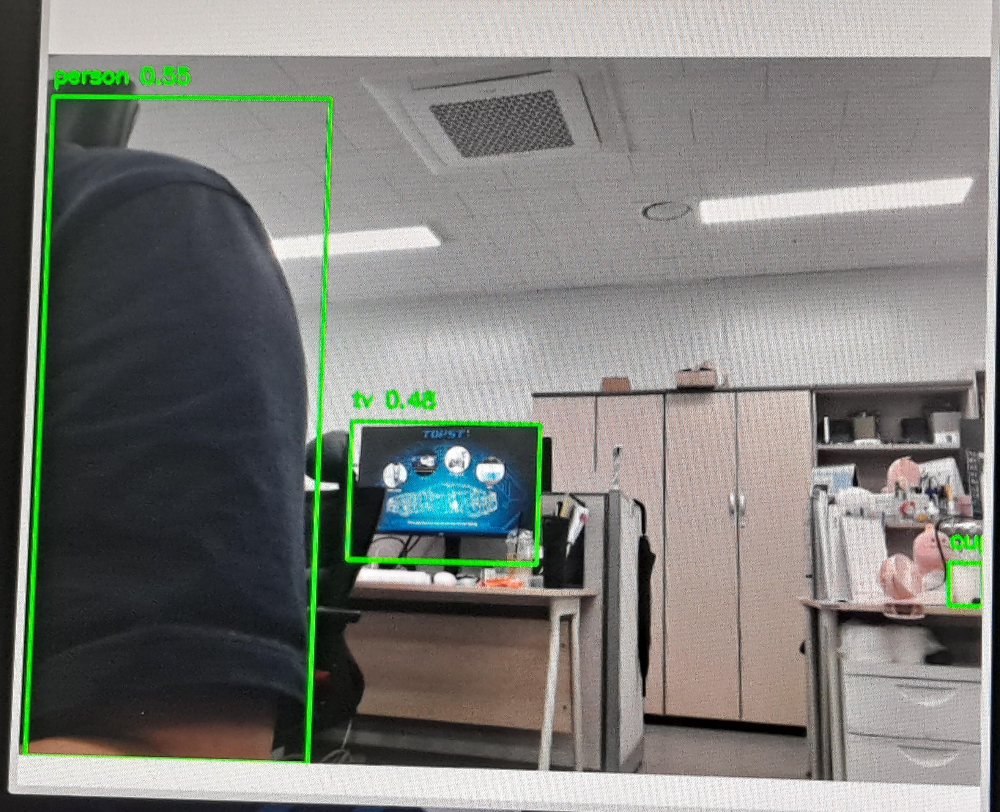

## 프로젝트 정보

- 

[](https://git.huconn.com/topst-project/webcam_object-recognition)

이 작업은 파이썬으로 수행되었으며, YOLOv5n의 OpenCV를 사용하였습니다.

!https://s3-us-west-2.amazonaws.com/secure.notion-static.com/dc6ee192-98bb-40ee-ba9d-8e1073a3864d/Untitled.png

- 실시간 웹캠 인식 시스템 구현

보드의 한계로 인해 YOLOv5n을 사용하였으며, 

속도는 빠르지만 정확도는 낮은 모델을 사용하였습니다.

VSCode 설치 방법:

1. 다음 명령어를 실행하세요: wget -qO- https://packages.microsoft.com/keys/microsoft.asc | gpg --dearmor > packages.microsoft.gpg
2. packages.microsoft.gpg 파일을 /etc/apt/trusted.gpg.d/ 디렉토리에 복사합니다: sudo install -o root -g root -m 644 packages.microsoft.gpg /etc/apt/trusted.gpg.d/
3. 다음 명령어를 실행하여 /etc/apt/sources.list.d/vscode.list 파일을 만듭니다: sudo sh -c 'echo "deb [arch=arm64] https://packages.microsoft.com/repos/code stable main" > /etc/apt/sources.list.d/vscode.list'
4. 패키지 목록을 업데이트합니다: sudo apt update
5. VSCode를 설치합니다: sudo apt install code

실행 방법:

다음 명령어를 입력하세요:
code --no-sandbox --user-data-dir=/path/to/alternate/user/data/dir

진행 방법:

- pip을 설치하려면 다음 명령을 실행하십시오.

```
sudo apt install python3-pip

```

- Git을 설치하려면 다음 명령을 사용하십시오.

```
sudo apt install git

```

- 그런 다음 pip를 사용하여 opencv-python을 설치할 수 있습니다.

```
pip install opencv-python

```

- torch와 torchvision을 설치하려면 다음 명령을 실행하십시오.

```
pip install torch torchvision

```

- yolov5를 클론하려면 다음 명령을 실행하십시오.

```bash
git clone https://github.com/ultralytics/yolov5
cd yolov5/
pip install -r requirements.txt
wget https://github.com/ultralytics/yolov5/releases/download/v6.0/yolov5n.pt
```

```python
import cv2
from PIL import Image
import torch

def load_yolo_model():
    # YOLOv5 모델 로드
    model = torch.hub.load('ultralytics/yolov5', 'yolov5n', pretrained=True) #모델을 저장소에서 load
    return model

def detect_objects(model, webcam_idx=1, width=480, height=640): # 너비와 높이를 640으로 설정
    # 웹캠으로부터 비디오 스트림 가져오기
    cap = cv2.VideoCapture(webcam_idx) #웹캠 띄우기
    cap.set(cv2.CAP_PROP_FRAME_WIDTH, width) # 웹캠의 너비 설정
    cap.set(cv2.CAP_PROP_FRAME_HEIGHT, height) # 웹캠의 높이 설정

    while True:
        # 비디오 프레임 읽기
        ret, frame = cap.read()
        if not ret:
            break

        # OpenCV 프레임을 PIL 이미지로 변환 
        image = Image.fromarray(cv2.cvtColor(frame, cv2.COLOR_BGR2RGB)) #이미지를 조절하고 회전시킬 수 있도록 변환하는 작업

        # YOLOv5를 사용하여 물체 감지 수행
        results = model(image)

        # 결과 가져오기
        results.print()  # 화면에 결과 출력 (필요에 따라 주석 처리 가능)
      # results.save()   # 이미지 파일로 저장 (필요에 따라 주석 처리 가능)

        # 감지된 물체를 프레임에 그리기
        for *xyxy, conf, cls in results.pred[0]: #results.pred 물체정보 리스트 conf 신뢰도 cls 클래스
            label = f'{model.names[int(cls)]} {conf:.2f}' #물체의 이름을 가져옴
            xyxy = [int(x) for x in xyxy] #좌표값을 정수로 변환
            cv2.rectangle(frame, (xyxy[0], xyxy[1]), (xyxy[2], xyxy[3]), (0, 255, 0), 2) #프레임 이미지에 정의된 좌표를 통해 사각형을 그림
            cv2.putText(frame, label, (xyxy[0], xyxy[1] - 10), #프레임 이미지에 지정된 좌표를 추가 
                        cv2.FONT_HERSHEY_SIMPLEX, 0.5, (0, 255, 0), 2) #cv2.FONT_HERSHEY_SIMPLEX를 사용하며, 크기는 0.5로 지정되고, 색상은 (0, 255, 0)으로 설정

        # 화면에 프레임 표시
        cv2.imshow('YOLOv5 Object Detection', frame)

        # 'q' 키를 누르면 종료
        if cv2.waitKey(1) & 0xFF == ord('q'):
            break

    # 비디오 스트림과 창 닫기
    cap.release()
    cv2.destroyAllWindows()

if __name__ == '__main__':
    # YOLOv5 모델 로드
    model = load_yolo_model()

    # 웹캠으로부터 물체 감지
    detect_objects(model)
```

yolov5n.pt는 python폴더와 함께 있어야 합니다.

해당 작업은 보드에 웹캠을 연결한 후, 보드에 설치된 vscode를 직접 설치하여 진행합니다.

